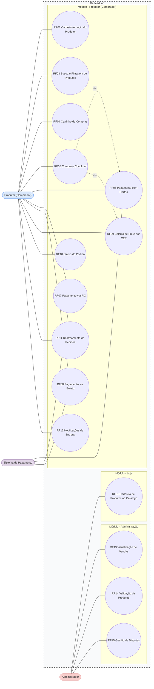
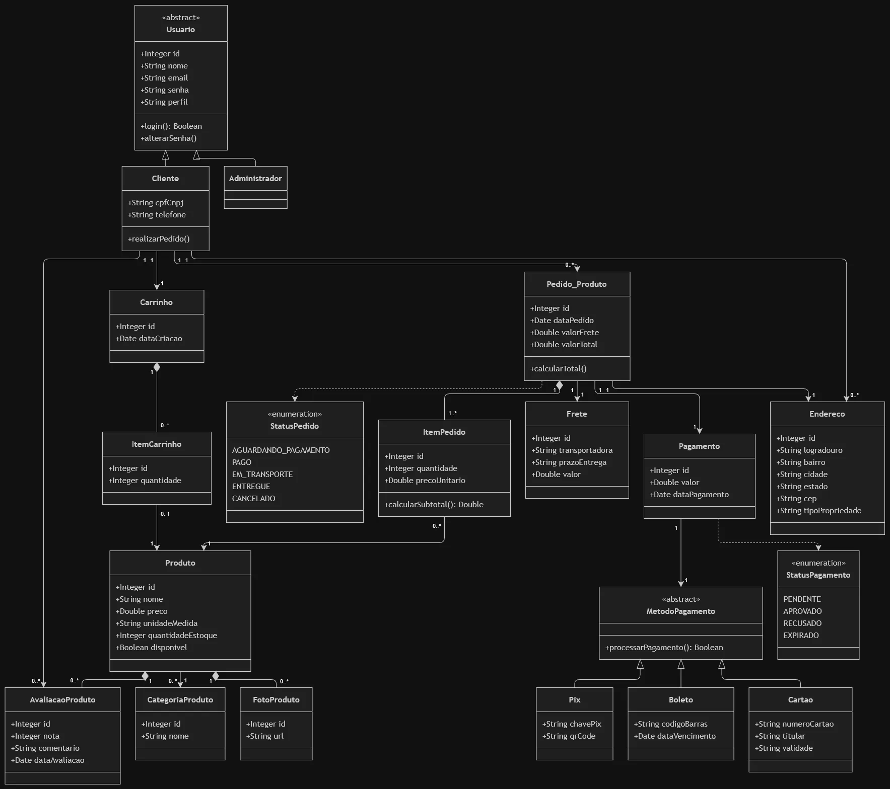
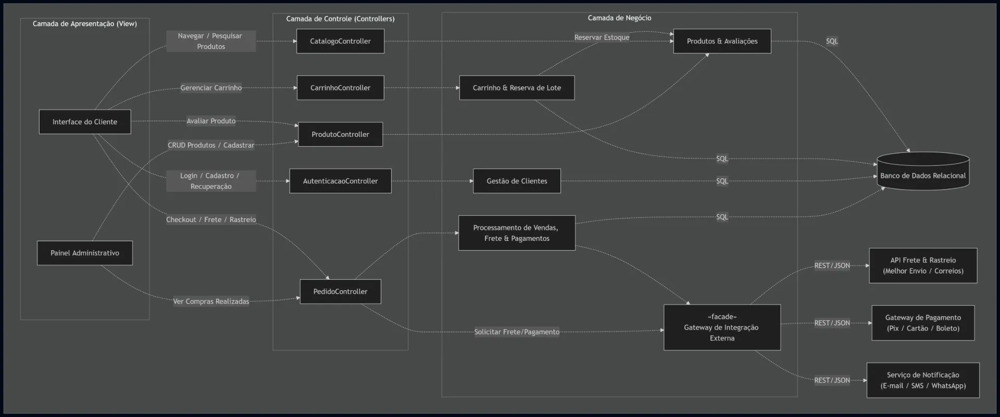
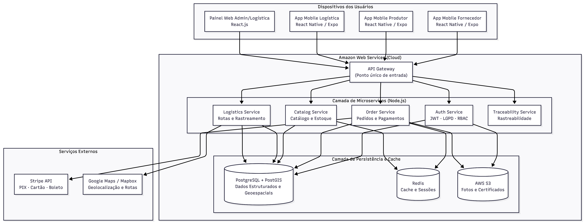

# Modelagem Técnica

## Casos de Uso (UML)

A modelagem do sistema segue a notação UML padrão [@bezerra2015]. O diagrama de casos de uso do ReFeed.inc mapeia as interações entre os seguintes atores e suas ações:

- **Loja:** Cadastra e gerencia os Produtos (ração/adubo) no catálogo, define Preços e visualiza Vendas realizadas.
- **Produtor (Comprador):** Realiza Cadastro/*Login*, Busca Produtos, efetua Compras e acompanha Entregas com Rastreabilidade.
- **Administrador:** Valida Produtos e Certificados, monitora Indicadores e resolve Disputas.
- **Sistema de Pagamento:** Interage diretamente com os casos de uso de Pagamento iniciados pelo Produtor.

### Diagrama de Casos de Uso

Fonte: Autores.

### Especificação dos Casos de Uso

#### UC01: Cadastrar Produto (Loja)

**Ator principal:** Administrador (Perfil da Loja)

**Objetivo (Meta):** Registrar novos insumos agrícolas (ração reaproveitada ou adubo orgânico) no catálogo.

**Pré-condições:** O Administrador deve estar autenticado no sistema com perfil de acesso apropriado.

**Fluxo principal (cenário de sucesso):**

1. O Administrador acessa o menu de gestão do catálogo de produtos.
2. O sistema exibe o formulário de cadastro de insumos.
3. O Administrador preenche as informações do produto (nome, descrição, categoria [ração/adubo], preço por unidade, quantidade em estoque, lote e envia as fotos).
4. O Administrador confirma a inclusão.
5. O sistema valida os dados inseridos, persiste o produto na base de dados e exibe mensagem de sucesso.

**Fluxos alternativos ou de exceção:**

- **FA01 - Dados obrigatórios incompletos:** Se o Administrador deixar de preencher algum campo obrigatório, o sistema impede o envio, destaca os campos faltantes e solicita a correção.
- **FE01 - Erro ao enviar imagem:** Se o arquivo de imagem exceder o limite de tamanho permitido ou tiver formato inválido, o sistema notifica a falha e solicita o envio de um novo arquivo.

#### UC02: Cadastrar Usuário

**Ator principal:** Cliente (Produtor Rural / Usuário)

**Objetivo (Meta):** Criar uma conta de acesso na plataforma para realizar compras e gerenciar pedidos.

**Pré-condições:** O visitante deve ter acesso ao Portal do Agricultor.

**Fluxo principal (cenário de sucesso):**

1. O visitante acessa a tela de cadastro do sistema.
2. O sistema apresenta o formulário de registro.
3. O cliente preenche seus dados pessoais (nome, CPF/CNPJ, e-mail, senha de acesso e endereço de entrega).
4. O cliente confirma a criação da conta.
5. O sistema valida a unicidade do e-mail/documento, salva o registro e redireciona o cliente autenticado.

**Fluxos alternativos ou de exceção:**

- **FE01 - Usuário/E-mail já cadastrado:** Se o CPF/CNPJ ou e-mail já estiverem registrados, o sistema avisa que o cadastro já existe e oferece a opção de recuperar a conta.
- **FE02 - Senha fora do padrão:** Caso a senha não cumpra a complexidade mínima de segurança, o sistema informa a regra necessária.

#### UC03: Realizar Login

**Ator principal:** Cliente ou Administrador

**Objetivo (Meta):** Autenticar-se no sistema para acessar funcionalidades protegidas e dados da conta.

**Pré-condições:** O ator deve possuir uma conta previamente cadastrada no sistema.

**Fluxo principal (cenário de sucesso):**

1. O ator clica na opção de entrar/login no portal.
2. O sistema exibe os campos de credenciais.
3. O ator digita seu e-mail/identificador e a senha cadastrada.
4. O sistema valida as credenciais informadas.
5. O sistema gera a sessão autenticada (Token JWT) e libera as permissões correspondentes.

**Fluxos alternativos ou de exceção:**

- **FE01 - Credenciais inválidas:** Se o e-mail ou a senha estiverem incorretos, o sistema exibe uma mensagem genérica de erro e não concede o acesso.

#### UC04: Mostrar Produtos no Estoque

**Ator principal:** Cliente / Visitante

**Objetivo (Meta):** Visualizar a disponibilidade atualizada dos insumos orgânicos disponíveis para venda.

**Pré-condições:** Nenhuma.

**Fluxo principal (cenário de sucesso):**

1. O usuário acessa a página do catálogo do e-commerce.
2. O sistema consulta a quantidade atualizada dos lotes no estoque.
3. O sistema exibe os produtos indicando o valor e o status de disponibilidade ("Em Estoque" / "Esgotado").

**Fluxos alternativos ou de exceção:**

- **FA01 - Estoque esgotado:** Se a quantidade de um lote atingir zero, o produto é sinalizado como indisponível para novos carrinhos.

#### UC05: Comprar Produto (Checkout)

**Ator principal:** Cliente (Produtor Rural)

**Objetivo (Meta):** Concluir o processo de aquisição dos insumos do carrinho gerando um novo pedido.

**Pré-condições:** O cliente deve estar autenticado, ter itens válidos no carrinho e frete calculado.

**Fluxo principal (cenário de sucesso):**

1. O cliente clica em "Finalizar Compra" a partir da tela do carrinho.
2. O sistema solicita a confirmação do endereço e a escolha do método de pagamento (Pix, Cartão de Crédito/Débito ou Boleto).
3. O cliente insere as informações de pagamento e confirma a ordem de compra.
4. O sistema processa o pedido, consolida os valores (itens + frete) e redireciona para a confirmação.

**Fluxos alternativos ou de exceção:**

- **FE01 - Expiração de reserva:** Se o tempo limite da reserva de estoque expirar antes da confirmação do pagamento, o sistema notifica o cliente e solicita a atualização do carrinho.

#### UC06: Realizar Pagamento via Pix

**Ator principal:** Cliente

**Objetivo (Meta):** Pagar o valor do pedido utilizando transferência instantânea Pix.

**Pré-condições:** Ter iniciado a etapa de checkout.

**Fluxo principal (cenário de sucesso):**

1. O cliente seleciona a opção de pagamento "Pix".
2. O sistema integra com o gateway financeiro e gera o código QR Code e a chave "Copia e Cola".
3. O cliente realiza o pagamento em seu aplicativo bancário.
4. O gateway notifica a plataforma sobre a aprovação e o status do pedido é alterado para "Pago".

**Fluxos alternativos ou de exceção:**

- **FE01 - Expiração do QR Code:** Se o pagamento não for realizado dentro do prazo do código (ex: 30 minutos), a chave expira e o pedido é automaticamente cancelado.

#### UC07: Realizar Pagamento via Cartão de Crédito ou Débito

**Ator principal:** Cliente

**Objetivo (Meta):** Quitar a compra usando os dados do cartão de crédito ou débito.

**Pré-condições:** Estar na etapa final do pedido de compra.

**Fluxo principal (cenário de sucesso):**

1. O cliente escolhe o método "Cartão de Crédito ou Débito".
2. O cliente digita o número do cartão, nome impresso, validade e código de segurança (CVV).
3. O sistema encaminha a requisição de cobrança ao gateway de pagamento.
4. A administradora autoriza a transação financeiramente e o pedido é aprovado.

**Fluxos alternativos ou de exceção:**

- **FE01 - Transação recusada:** Caso o cartão seja recusado por saldo insuficiente ou divergência de dados, o sistema apresenta o aviso da operadora e permite digitar novo cartão ou mudar o meio de pagamento.

#### UC08: Realizar Pagamento via Boleto

**Ator principal:** Cliente

**Objetivo (Meta):** Gerar o documento de compensação bancária para quitação do pedido.

**Pré-condições:** Estar no encerramento da compra.

**Fluxo principal (cenário de sucesso):**

1. O cliente seleciona a opção "Boleto Agrícola / Bancário".
2. O sistema gera a representação numérica e a linha digitável do boleto bancário através da integração bancária.
3. O cliente visualiza a opção de baixar/imprimir o documento.
4. O sistema registra o pedido com o status "Aguardando Pagamento".

**Fluxos alternativos ou de exceção:**

- **FE01 - Não pagamento dentro do vencimento:** Se a compensação bancária não for confirmada no prazo estipulado (ex: 3 dias úteis), a compra é cancelada automaticamente.

#### UC09: Calcular Frete da Entrega com CEP

**Ator principal:** Cliente / Visitante

**Objetivo (Meta):** Estimar o valor e o prazo de entrega do transporte rodoviário/rural com base na localização.

**Pré-condições:** Haver produtos no carrinho ou estar na visualização da oferta do insumo.

**Fluxo principal (cenário de sucesso):**

1. O ator digita o CEP da propriedade ou fazenda no campo indicado.
2. O sistema envia a cotação externa de entrega contendo o peso estimado da carga e o CEP de destino.
3. O serviço calcula a rota e retorna o custo acumulado do frete e o prazo estimado de entrega.
4. O sistema exibe o resultado na tela do cliente.

**Fluxos alternativos ou de exceção:**

- **FE01 - CEP não localizado/inválido:** Se a busca por CEP falhar, o sistema emite um alerta pedindo ao cliente que revise a digitação.

#### UC10: Rastrear Entrega do Produto

**Ator principal:** Cliente

**Objetivo (Meta):** Acompanhar a localização e a etapa de despacho da compra efetuada.

**Pré-condições:** O cliente deve ter finalizado um pedido que já possua código de rastreio atribuído.

**Fluxo principal (cenário de sucesso):**

1. O cliente acessa o histórico de seus pedidos no portal.
2. O cliente seleciona a opção "Rastrear Pedido" na compra desejada.
3. O sistema requisita a atualização da carga junto à API da transportadora.
4. O sistema exibe o status operacional do frete (ex: "Em Separação", "Em Trânsito", "Entregue").

**Fluxos alternativos ou de exceção:**

- **FA01 - Rastreio indisponível:** Se a transportadora ainda não gerou movimentação do lote, o sistema exibe a mensagem de que a nota/rastreio está em processamento.

#### UC11: Visualizar Compras Realizadas (Perfil Loja)

**Ator principal:** Administrador (Perfil da Loja)

**Objetivo (Meta):** Consultar a lista de vendas globais concluídas pela plataforma para controle operacional.

**Pré-condições:** O perfil administrativo deve estar autenticado.

**Fluxo principal (cenário de sucesso):**

1. O Administrador acessa o módulo de vendas do Portal Administrativo.
2. O sistema consulta o histórico relacional das transações registradas no banco de dados.
3. O sistema constrói um painel listando os pedidos, dados do comprador, valor total, método de pagamento e data.

**Fluxos alternativos ou de exceção:**

- **FA01 - Filtragem por período:** O Administrador pode aplicar filtros por data ou status de pedido para especificar os resultados mostrados.

#### UC12: Enviar Notificação de Entrega

**Ator principal:** Sistema (Integrador / Serviço Interno)

**Objetivo (Meta):** Alertar automaticamente o cliente a cada mudança relevante no percurso de entrega do insumo.

**Pré-condições:** O pedido deve ter sofrido alteração em seu status de despacho.

**Fluxo principal (cenário de sucesso):**

1. O serviço de frete atualiza a situação do transporte.
2. O sistema aciona o módulo integrador de notificações.
3. O sistema formata e dispara uma mensagem automatizada (E-mail / WhatsApp / SMS) contendo a atualização para o cliente.
4. O sistema armazena a alteração no histórico do pedido.

**Fluxos alternativos ou de exceção:**

- **FE01 - Falha no envio:** Se o gateway de comunicação falhar (ex: e-mail inválido), a tentativa é registrada no log para nova tentativa sem bloquear a alteração de status da entrega.

#### UC13: Avaliar Produto

**Ator principal:** Cliente

**Objetivo (Meta):** Registrar opinião, nota e feedback sobre a qualidade do adubo ou ração adquirida.

**Pré-condições:** O cliente deve estar logado e ter concluído a entrega do insumo a ser avaliado.

**Fluxo principal (cenário de sucesso):**

1. O cliente abre a tela de detalhes do produto ou seus pedidos concluídos.
2. O cliente clica no espaço dedicado para avaliação.
3. O cliente seleciona uma nota de 1 a 5 estrelas e insere um parecer descritivo.
4. O cliente confirma o envio.
5. O sistema vincula a avaliação ao produto no banco de dados e atualiza a média das avaliações públicas.

**Fluxos alternativos ou de exceção:**

- **FE01 - Tentativa sem compra efetuada:** Se o usuário tentar avaliar um produto que nunca comprou, o sistema bloqueia o envio solicitando a compra prévia para a validação do feedback.

#### UC14: Adicionar Produto ao Carrinho

**Ator principal:** Cliente / Visitante

**Objetivo (Meta):** Selecionar itens e quantidades no catálogo armazenando-os para compra posterior.

**Pré-condições:** O produto selecionado deve estar disponível no estoque.

**Fluxo principal (cenário de sucesso):**

1. O usuário visualiza um produto no catálogo.
2. O usuário escolhe a quantidade desejada de lotes/unidades e clica em "Adicionar ao Carrinho".
3. O sistema inclui o item na sessão de compras ativa.
4. O sistema exibe o carrinho atualizado com o resumo dos itens.

**Fluxos alternativos ou de exceção:**

- **FE01 - Quantidade indisponível:** Se a quantidade solicitada pelo usuário for superior ao saldo total do estoque do lote, o sistema impede a adição total e notifica o limite disponível.

#### UC15: Navegar pelo Site

**Ator principal:** Cliente / Visitante

**Objetivo (Meta):** Explorar a estrutura de páginas do e-commerce, menus e seções institucionais.

**Pré-condições:** Nenhuma.

**Fluxo principal (cenário de sucesso):**

1. O ator interage com o menu de navegação, categorias ou banner inicial do site.
2. O sistema interpreta o endereço/rota requisitado.
3. O sistema carrega e exibe a página correspondente (ex: "Sobre", "Insumos", "Contato").

**Fluxos alternativos ou de exceção:**

- **FE01 - Página não encontrada (Erro 404):** Se a rota requerida não existir, o sistema exibe uma página orientativa com link para a home.

#### UC16: Pesquisar Produtos

**Ator principal:** Cliente / Visitante

**Objetivo (Meta):** Localizar insumos agrícolas específicos por palavras-chave ou aplicando filtros de busca.

**Pré-condições:** Nenhuma.

**Fluxo principal (cenário de sucesso):**

1. O ator digita um termo no campo de busca (ex: "ração para gado", "adubo orgânico") ou seleciona um filtro.
2. O sistema executa a consulta na base de dados do catálogo.
3. O sistema retorna a lista de produtos cujos nomes/tags correspondam aos parâmetros pesquisados.

**Fluxos alternativos ou de exceção:**

- **FA01 - Nenhum produto encontrado:** Se a pesquisa não retornar resultados, o sistema avisa que não foram localizados produtos para aquele termo e sugere termos parecidos.

#### UC17: Reservar Estoque para o Cliente

**Ator principal:** Sistema (Módulo Carrinho / Estoque)

**Objetivo (Meta):** Garantir o bloqueio temporário das unidades selecionadas do lote no estoque durante o checkout.

**Pré-condições:** O cliente deve iniciar o processo de inclusão ou decisão de compra dos produtos.

**Fluxo principal (cenário de sucesso):**

1. O cliente aciona o fluxo de fechamento ou manutenção do carrinho.
2. O sistema envia requisição de reserva temporária para o gerenciador de lotes.
3. O sistema decrementa temporariamente a quantidade livre para venda pelo tempo limite determinado (ex: 15 minutos).
4. O status da reserva é confirmado e retornado ao carrinho.

**Fluxos alternativos ou de exceção:**

- **FE01 - Falha na concorrência de estoque:** Se outro cliente efetivar a compra do mesmo lote no exato instante anterior, o sistema invalida a tentativa e avisa o cliente sobre o término de unidades.

### Histórias de Usuário

Cada caso de uso foi traduzido em uma história de usuário no formato *Como/Quero/Para que*, acompanhada de seus critérios de aceitação, alinhando a especificação ao desenvolvimento ágil do projeto.

**História US01 (UC01 - Cadastrar Produto)**
: Como **Administrador (Perfil da Loja)**, eu quero **cadastrar insumos agrícolas (ração reaproveitada ou adubo orgânico) no catálogo com nome, descrição, categoria, preço, quantidade em estoque, lote e fotos**, para que **os produtos estejam disponíveis para venda no e-commerce**.
    - **Critérios de aceitação:** o sistema valida campos obrigatórios e bloqueia o envio incompleto destacando os campos faltantes; rejeita imagens acima do limite de tamanho ou com formato inválido notificando o erro; persiste o produto com sucesso e exibe mensagem de confirmação.

**História US02 (UC02 - Cadastrar Usuário)**
: Como **Cliente (Produtor Rural / Usuário)**, eu quero **criar uma conta informando nome, CPF/CNPJ, e-mail, senha e endereço de entrega**, para que **possa realizar compras e gerenciar meus pedidos na plataforma**.
    - **Critérios de aceitação:** o sistema impede duplicidade de CPF/CNPJ ou e-mail e orienta a recuperação de conta quando o cadastro já existe; valida a complexidade mínima da senha; redireciona o cliente autenticado após o registro concluído.

**História US03 (UC03 - Realizar Login)**
: Como **Cliente ou Administrador**, eu quero **autenticar-me informando e-mail/identificador e senha**, para que **eu possa acessar funcionalidades protegidas e os dados da minha conta**.
    - **Critérios de aceitação:** o sistema gera sessão autenticada (Token JWT) e libera as permissões correspondentes ao perfil; exibe mensagem genérica de erro e não concede acesso quando as credenciais são inválidas.

**História US04 (UC04 - Mostrar Produtos no Estoque)**
: Como **Cliente / Visitante**, eu quero **visualizar o catálogo de insumos com valor e status de disponibilidade atualizados**, para que **eu saiba quais lotes estão "Em Estoque" ou "Esgotados" antes de comprar**.
    - **Critérios de aceitação:** o sistema consulta a quantidade atualizada dos lotes; produtos com quantidade zero são sinalizados como indisponíveis para novos carrinhos.

**História US05 (UC05 - Comprar Produto / Checkout)**
: Como **Cliente (Produtor Rural)**, eu quero **concluir a compra dos itens do carrinho confirmando endereço e método de pagamento**, para que **um novo pedido seja gerado com os valores consolidados (itens + frete)**.
    - **Critérios de aceitação:** o sistema só finaliza o pedido com cliente autenticado, itens válidos no carrinho e frete calculado; se a reserva de estoque expirar antes da confirmação, o cliente é notificado e precisa atualizar o carrinho.

**História US06 (UC06 - Realizar Pagamento via Pix)**
: Como **Cliente**, eu quero **pagar meu pedido via Pix usando QR Code ou chave "Copia e Cola"**, para que **o pagamento seja processado instantaneamente e o pedido seja marcado como "Pago"**.
    - **Critérios de aceitação:** o sistema integra com o gateway financeiro e gera o QR Code e a chave; se o pagamento não for realizado no prazo do código (ex: 30 minutos), a chave expira e o pedido é cancelado automaticamente.

**História US07 (UC07 - Realizar Pagamento via Cartão)**
: Como **Cliente**, eu quero **pagar meu pedido com cartão de crédito ou débito informando número, nome, validade e CVV**, para que **o pedido seja aprovado após a autorização da operadora**.
    - **Critérios de aceitação:** o sistema encaminha a cobrança ao gateway de pagamento; em caso de recusa, apresenta o aviso da operadora e permite digitar novo cartão ou mudar o meio de pagamento.

**História US08 (UC08 - Realizar Pagamento via Boleto)**
: Como **Cliente**, eu quero **gerar um boleto bancário para quitar meu pedido**, para que **eu possa pagar dentro do prazo de vencimento e aguardar a compensação**.
    - **Critérios de aceitação:** o sistema gera o documento com linha digitável por integração bancária; registra o pedido como "Aguardando Pagamento"; se a compensação não for confirmada no prazo (ex: 3 dias úteis), a compra é cancelada automaticamente.

**História US09 (UC09 - Calcular Frete com CEP)**
: Como **Cliente / Visitante**, eu quero **consultar o frete informando o CEP da propriedade ou fazenda**, para que **eu veja o custo acumulado e o prazo estimado de entrega da carga**.
    - **Critérios de aceitação:** o sistema envia a cotação externa de entrega com peso estimado e CEP de destino; se o CEP não for localizado ou for inválido, o sistema emite alerta solicitando a revisão da digitação.

**História US10 (UC10 - Rastrear Entrega do Produto)**
: Como **Cliente**, eu quero **acompanhar a localização e a etapa de despacho da compra efetuada**, para que **eu saiba se meu pedido está em separação, em trânsito ou entregue**.
    - **Critérios de aceitação:** o sistema requisita a atualização da carga junto à API da transportadora e exibe o status operacional do frete; se não houver movimentação do lote ainda, exibe que a nota/rastreio está em processamento.

**História US11 (UC11 - Visualizar Compras no Perfil Loja)**
: Como **Administrador (Perfil da Loja)**, eu quero **consultar a lista de vendas globais concluídas pela plataforma**, para que **eu tenha controle operacional sobre pedidos, compradores, valores e pagamentos**.
    - **Critérios de aceitação:** o sistema consulta o histórico das transações e constrói painel com pedidos, dados do comprador, valor total, método de pagamento e data; permite filtrar por período ou status do pedido.

**História US12 (UC12 - Enviar Notificação de Entrega)**
: Como **Sistema (Integrador / Serviço Interno)**, eu quero **disparar notificações automatizadas (E-mail / WhatsApp / SMS) a cada mudança no status da entrega**, para que **o cliente seja alertado automaticamente sobre o percurso da entrega**.
    - **Critérios de aceitação:** o sistema aciona o módulo integrador de notificações e armazena a alteração no histórico do pedido; em falha de envio, registra a tentativa no log para nova tentativa sem bloquear a atualização de status.

**História US13 (UC13 - Avaliar Produto)**
: Como **Cliente**, eu quero **registrar opinião, nota de 1 a 5 estrelas e feedback sobre o insumo adquirido**, para que **outros compradores conheçam a qualidade do adubo ou ração avaliada**.
    - **Critérios de aceitação:** o sistema vincula a avaliação ao produto e atualiza a média pública; bloqueia o envio quando o usuário tenta avaliar um produto que nunca comprou.

**História US14 (UC14 - Adicionar Produto ao Carrinho)**
: Como **Cliente / Visitante**, eu quero **selecionar a quantidade desejada de lotes/unidades e adicioná-los ao carrinho**, para que **eu possa armazená-los para compra posterior**.
    - **Critérios de aceitação:** o sistema inclui o item na sessão de compras ativa e exibe o resumo atualizado; se a quantidade solicitada exceder o saldo do lote, impede a adição total e notifica o limite disponível.

**História US15 (UC15 - Navegar pelo Site)**
: Como **Cliente / Visitante**, eu quero **explorar menus, categorias, banner inicial e páginas institucionais do e-commerce**, para que **eu conheça a estrutura e o conteúdo da plataforma (ex: "Sobre", "Insumos", "Contato")**.
    - **Critérios de aceitação:** o sistema carrega a página correspondente à rota requisitada; para rotas inexistentes, exibe página orientativa de erro 404 com link para a home.

**História US16 (UC16 - Pesquisar Produtos)**
: Como **Cliente / Visitante**, eu quero **pesquisar insumos por palavras-chave ou aplicar filtros de busca**, para que **eu localize rapidamente os produtos que correspondem ao que procuro**.
    - **Critérios de aceitação:** o sistema executa a consulta na base do catálogo e retorna produtos cujos nomes/tags correspondam aos parâmetros; sem resultados, avisa que nada foi encontrado e sugere termos parecidos.

**História US17 (UC17 - Reservar Estoque para o Cliente)**
: Como **Sistema (Módulo Carrinho / Estoque)**, eu quero **bloquear temporariamente as unidades selecionadas do lote durante o checkout**, para que **a quantidade reservada fique garantida ao cliente pelo tempo limite estipulado (ex: 15 minutos)**.
    - **Critérios de aceitação:** o sistema envia requisição de reserva ao gerenciador de lotes e decrementa temporariamente a quantidade livre para venda; em concorrência de estoque, invalida a tentativa e avisa o cliente sobre o término de unidades.

## Diagrama de Classes

A estrutura estática do sistema é representada pelo diagrama de classes a seguir, que relaciona as entidades centrais do domínio: Loja, Produtor, Produto, Pedido, Pagamento, Entrega e Rastreabilidade.

{#fig-classes}

Fonte: Autores.

## Diagrama de Componentes (Microserviços)

O fluxo arquitetural segue o padrão estabelecido:

Apps Mobile / Web → API Gateway (ponto único de entrada) → Microserviços → Bases de Dados

### Camada de Microserviços

- **Auth Service:** Gerencia JWT, conformidade com a LGPD e controle de acesso por perfil (Loja, Produtor, Administrador).
- **Order Service:** Processa Pedidos, fluxo de Pagamento e faturamento entre a Loja e os compradores.
- **Catalog Service:** Gerencia Catálogo de Resíduos Orgânicos, produtos (ração/adubo) e Estoque.
- **Delivery Service:** Gerencia entregas, cálculo de frete e rastreamento em tempo real.
- **Traceability Service:** Responsável pela rastreabilidade completa: origem do resíduo → processamento → produto final (ração ou adubo).

{#fig-componentes}

Fonte: Autores.

### Camada de Persistência e Cache

- **PostgreSQL + PostGIS (Dados Estruturados e Geoespaciais):** Consumido pelos serviços de Autenticação (Auth), Pedidos (Order), Catálogo (Catalog) e Entregas (Delivery) com consultas de proximidade e rotas.
- **Redis (Cache / Sessões):** Utilizado para otimização nos serviços de Pedidos (Order) e Catálogo (Catalog).
- **AWS S3 (Armazenamento):** Destinado à persistência de fotos de resíduos, certificados de qualidade e documentos de rastreabilidade.

A arquitetura geral do sistema segue o padrão de microsserviços, com ponto único de entrada via API Gateway distribuindo requisições entre os serviços especializados e persistindo dados nas camadas de PostgreSQL, Redis e S3 conforme a necessidade de cada operação.

### Diagrama de Implantação

O ReFeed.inc é implantado em infraestrutura em nuvem (AWS). Os aplicativos *mobile* (React Native / Expo) e os painéis *web* (React.js) acessam o sistema via API Gateway, que distribuí as requisições entre os microsserviços *Node.js*. Os dados são persistidos em PostgreSQL + PostGIS e Redis, com arquivos armazenados no AWS S3. Integrações externas realizam o processamento de pagamentos (Stripe) e a geolocalização e otimização de rotas (Google Maps / Mapbox).

{#fig-implantacao}

Fonte: Autores.

## Diagrama de Sequência

O diagrama de sequência representa a interação temporal entre os atores e os componentes do sistema, destacando a ordem cronológica das mensagens trocadas em um cenário específico, como o fluxo desde a busca e compra de produtos até a entrega do produto final ao produtor rural.

{#fig-sequencia}

Fonte: Autores.
